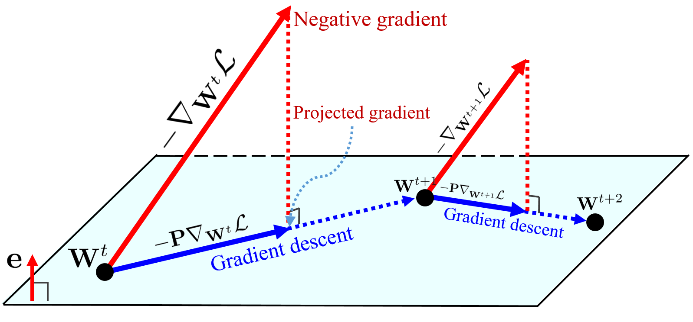

# Best-Deep-Learning-Optimizers 
Collection of the latest, greatest, deep learning optimizers (for Pytorch) - CNN, NLP suitable
  
Current top performers = Ranger with Gradient Centralization is the leader (April 11/2020)  this is only on initial testing.
  
## Updates - new version of Ranger with highest accuracy to date for all optimizers tested:
April 11 - New version of Ranger released (20.4.11), highest score for accuracy to date.  
 Ranger has been upgraded to use Gradient Centralization.  See: https://arxiv.org/abs/2004.01461  and github:  https://github.com/Yonghongwei/Gradient-Centralization

It will now use GC by default, and run it for both conv layers and fc layers. You can turn it on or off with "use_gc" at init to test out the difference on your datasets.

(image from gc github).   
 The summary of gradient centralization: "GC can be viewed as a projected gradient descent method with a constrained loss function. The Lipschitzness of the constrained loss function and its gradient is better so that the training process becomes more efficient and stable."
 

Note - for optimal accuracy, make sure you use run with a flat lr for some time and then cosine descent the lr (72% - 28% descent), or if you don't have an lr framework... very comparable results by running at one rate for 75%, then stop and decrease lr, and run remaining 28%. 

## Usage - GC on by default but you can control all aspects at init:

 
## Ranger will print settings at first init so you can confirm optimization is set the way you want it:

  Future work: MARTHE, HyperAdam and other optimizers will be tested and posted if they look good.  

 
12/27 - added DiffGrad, and unofficial version 1 support (coded from the paper). 
 
12/28 - added Diff_RGrad = diffGrad + Rectified Adam to start off....seems to work quite well. 

Medium article (summary and FastAI example usage):
https://medium.com/@lessw/meet-diffgrad-new-deep-learning-optimizer-that-solves-adams-overshoot-issue-ec63e28e01b2

Official diffGrad paper:  https://arxiv.org/abs/1909.11015v2

12/31 - AdaMod and DiffMod added.  Initial SLS files added (but more work needed).

<b>In Progress:</b>  
A - Parabolic Approximation Line Search:  https://arxiv.org/abs/1903.11991v2

B - Stochastic Line Search (SLS): pending (needs param group support)

c - AvaGrad 

<b>General papers of relevance:</b>

Does Adam stick close to the optimal point?  https://arxiv.org/abs/1911.00289v1

Probabalistic line searches for stochastic optimization (2017, matlab only but good theory work):  https://arxiv.org/abs/1703.10034v2  
